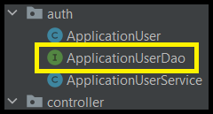
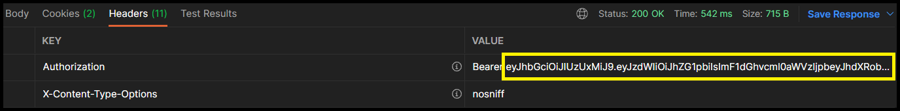

# Spring Security Walkthrough

<b><i>About / Disclaimer:</i></b> This walkthrough is designed to help those start from a beginning project up to a point where they
    can stop at the preferred method for their project. This project uses the free Amigos Code "Spring Security" course taught by Mamba
    Samba Braima, also known as Nelson, at https://www.amigoscode.com/p/spring-boot-security. I claim no rights on this code. Any
    intellectual property rights belong to him, and the associated rights belong to Amigos Code. Although some of the code has been
    changed, it was only to allow for functionality and personal preference due to modifications to the Java programming language and
    Spring Framework since the course's creation.

## Sections (*Click Section to jump to that section*)
 

Using Spring Security (Form-Based Authentication & Basic64 Authentication)

[1. Using Spring Security (In-Memory Default User)](#using-spring-security-in-memory-default-user)

[2. Using Spring Security (In-Memory Custom User)](#using-spring-security-in-memory-custom-user)

Using Spring Security (Roles & Permissions)

[3.1. Role-Based Authentication](#role-based-authentication)

[3.2. Permission-Based Authentication](#permission-based-authentication)

[3.3. Cross-Site Request Forgery Token](#cross-site-request-forgery-token)

Form-Based Authentication

[4. Spring Security Sessions](#spring-security-sessions)

Database Authentication

[5. Store Users In Database (Not In-Memory)](#store-users-in-database-not-in-memory)

JSON Web Tokens (JWTs)

[6. Use of Public/Private Keys for Authentication](#use-of-publicprivate-keys-for-authentication)

End of Walkthrough

[7. Final Notes](#final-notes)

#
# Using Spring Security (In-Memory Default User)
## Form-Based Authentication & Basic64 Authentication

1) Create a Spring Boot Project by implementing the dependencies in the 'pom.xml' or by using the Spring Initializr at
    https://start.spring.io/

    *If using Sprint Initializr, the only dependency to add is 'Spring Web' for the project.
        For those wanting to implement into a pre-existing project, 'pom.xml' dependencies are at the end of this step.

    - Main class:

            @SpringBootApplication
            public class SpringSecurityDemoApplication {

                public static void main(String[] args) {
                    SpringApplication.run(SpringSecurityDemoApplication.class, args);
                }
            }

    - New package named 'student'.

    - New class in package 'student' called Student:

            public class Student {
                private int student_id;
                private String student_name;

                public Student(int student_id, String student_name) {
                    this.student_id = student_id;
                    this.student_name = student_name;
                }

                public Student(String student_name) {
                    this.student_name = student_name;
                }

                public int getStudent_id() {
                    return student_id;
                }

                public void setStudent_id(int student_id) {
                    this.student_id = student_id;
                }

                public String getStudent_name() {
                    return student_name;
                }

                public void setStudent_name(String student_name) {
                    this.student_name = student_name;
                }
            }
    
    - New class in package 'student' called StudentController:

            @RestController
            @RequestMapping("/api/v1/students")
            public class StudentController {

                private static List<Student> students = Arrays.asList(
                        new Student (1, "John Smith"),
                        new Student (2, "Mary Smith"),
                        new Student (3, "Richard Smith")
                );

                @GetMapping(path = "{student_id}")
                public Student getStudent(@PathVariable("student_id") Integer student_id) {
                    return students.stream()
                            .filter(student -> student_id.equals(student.getStudent_id()))
                            .findFirst()
                            .orElseThrow(() -> new IllegalStateException("Student " + student_id + " does not exist!"));
                }
            }
    
    - (For those not using Spring Initializr) Add dependencies for Spring Boot / Web in 'pom.xml':

            // Put below 'modelVersion' tag at the top of 'pom.xml':
            <parent>
                <groupId>org.springframework.boot</groupId>
                <artifactId>spring-boot-starter-parent</artifactId>
                <version>2.7.0</version>
                <relativePath/> <!-- lookup parent from repository -->
            </parent>

            // If dependencies exist, include the dependencies inside project's 'dependencies' tag:
            <dependencies>
                <dependency>
                    <groupId>org.springframework.boot</groupId>
                    <artifactId>spring-boot-starter-web</artifactId>
                </dependency>

                <dependency>
                    <groupId>org.springframework.boot</groupId>
                    <artifactId>spring-boot-starter-security</artifactId>
                </dependency>

                <dependency>
                    <groupId>org.springframework.boot</groupId>
                    <artifactId>spring-boot-starter-test</artifactId>
                    <scope>test</scope>
                </dependency>
            </dependencies>

            // Put at end of 'pom.xml':
            <build>
                <plugins>
                    <plugin>
                        <groupId>org.springframework.boot</groupId>
                        <artifactId>spring-boot-maven-plugin</artifactId>
                    </plugin>
                </plugins>
            </build>
#

2) Add the Spring Boot Security framework dependency to 'pom.xml':

		<dependency>
			<groupId>org.springframework.boot</groupId>
			<artifactId>spring-boot-starter-security</artifactId>
		</dependency>

    * This dependency adds security automatically. When interacting with our Spring Boot application's URIs in the browser, it forwards 
        us to '/login', which requires signing in using default 'user' with the generated password in Spring Boot Terminal in IntelliJ.
        This also gives our application the '/login' and '/logout' URL paths so that we can sign in/out at request. This is known as
        'Basic Authentication' / 'Basic Auth'.

#

3) Create a new class to use Basic64 Authentication:

    - New package named 'security'.
    - New class called ApplicationSecurityConfig:

            @Configuration
            @EnableWebSecurity
            public class ApplicationSecurityConfig extends WebSecurityConfigurerAdapter {

                @Override
                protected void configure(HttpSecurity http) throws Exception {
                    http
                            .authorizeRequests()
                            .anyRequest()
                            .authenticated()
                            .and()
                            .httpBasic();
                }
            }

    * This class changes it from form-based authentication to Basic64 Authentication. When interacting with the application in the web
        browser, a popup appears requiring username and password (default username: user, password: located in IntelliJ terminal).
        Unfortunately, we do not have '/login' or '/logout' anymore since the username and password are passed through every request
        made to the application.

#

4) Whitelist certain URI paths to allow viewing without authentication using Ant Matchers:

    - Create new 'index.html' file in the 'resources/static' folder:

            <h1>Hello World!</h1>
    
    - Add '.antMatchers()' and '.permitAll()' to the security requests in the 'configure()' method of 'ApplicationSecurityConfig' class:

            @Configuration
            @EnableWebSecurity
            public class ApplicationSecurityConfig extends WebSecurityConfigurerAdapter {

                @Override
                protected void configure(HttpSecurity http) throws Exception {
                    http
                            .authorizeRequests()
                            // This is new \/
                            .antMatchers("/", "index", "/css/*", "/js/*")
                            .permitAll()
                            // This is new /\
                            .anyRequest()
                            .authenticated()
                            .and()
                            .httpBasic();
                }
            }

    * The Ant Matchers 'whitelists' paths/directories/files that can be retrieved from the server, regardless of signing in or not.
        When we try to access the specified paths or files that are given in the Ant Matcher's parameters, we do not require signing
        in. Since there are no popups for authentication, users can view content without signing in. Once we interact with paths that
        are not in the parameters, the popup appears and authentication is required.

#
# Using Spring Security (In-Memory Custom User)

1) Create a new bean 'UserDetailsService' in the 'ApplicationSecurityConfig' class for in-memory:

        @Override
        @Bean
        protected UserDetailsService userDetailsService() {
            UserDetails johnSmithUser = User.builder()
                    .username("johnsmith")
                    .password("password")
                    .roles("STUDENT")
                    .build();

            return new InMemoryUserDetailsManager(
                    johnSmithUser
            );
        }

    * This will create a new user in-memory to be able to sign in through the Spring Security framework in our browser. When trying to
        sign in, the browser will not allow us to sign in, and IntelliJ's terminal will tell us that authentication failed due to the
        password not being encrypted.

#

2) Create a new class in the 'security' package called 'PasswordConfig':

        @Configuration
        public class PasswordConfig {

            @Bean
            public PasswordEncoder passwordEncoder() {
                // Returns the password encoder with the strength of 10:
                return new BCryptPasswordEncoder(10);
            }
        }
    
    * This will create a new Bean object of Password Encoder that can be used to encrypt passwords.

#

3) Declare the password encoder and inject it into the constructor of 'ApplicationSecurityConfig' class:

        public public class ApplicationSecurityConfig extends WebSecurityConfigurerAdapter {

            // Declare the password encoder:
            private PasswordEncoder passwordEncoder;

            // Inject the password encoder into the constructor:
            @Autowired
            public ApplicationSecurityConfig(PasswordEncoder passwordEncoder) {
                this.passwordEncoder = passwordEncoder;
            }

        //...

    * This alone will not allow sign in because the error produced says that it does not look like 'BCrypt'.

#

4) Call the password encoder's 'encode()' method inside of the password parameter of the johnSmithUser UserDetails:

        UserDetails johnSmithUser = User.builder()
                .username("johnsmith")
                .password(passwordEncoder.encode("password"))
                .roles("STUDENT")
                .build();
    
    * Now, we can sign in using the given username and password above in the browser. The password becomes encoded to 'BCrypt', which
        encrypts the password and checks to see if the encrypted string matches the encrypted string for the user in-memory.
        Encryption example using BCrypt: "$2a$10$1Pa8zrgMWno2BPA9aVpvuu0HDg8HxGb2HTTH/9AGsxTIjZA26qAVe"

#
# Using Spring Security (Roles & Permissions)
## Role-Based Authentication

1) Create a new Administrator User inside of the 'UserDetailsService' of the 'ApplicationSecurityConfig' class:

    - Insert the new user below 'johnSmithUser' and modify the return values to contain the new admin user:

            UserDetails johnSmithUser = User.builder()
                .username("johnsmith")
                .password(passwordEncoder.encode("password"))
                .roles("STUDENT")
                .build();

            UserDetails adminUser = User.builder()
                .username("admin")
                .password(passwordEncoder.encode("password123"))
                .roles("ADMIN")
                .build();

            return new InMemoryUserDetailsManager(
                johnSmithUser,
                adminUser
            );
    
    * The new Administrator user will have access to all information and set privileges for that specific account.

#

2) Create new classes to assign roles to the users:

    - Add a new dependency to the 'pom.xml' for implementing roles and permissions:

        <dependency>
            <groupId>com.google.guava</groupId>
            <artifactId>guava</artifactId>
            <version>28.1-jre</version>
        </dependency>

    - Create a new 'ApplicationUserRole' Enum class in the 'security' package:

        import com.google.common.collect.Sets;
        import java.util.Set;
        import static ... .security.ApplicationUserPermission.*;

        public enum ApplicationUserRole {
            STUDENT(Sets.newHashSet()),
            ADMIN(Sets.newHashSet(COURSE_READ, COURSE_WRITE, STUDENT_READ, STUDENT_WRITE));

            private final Set<ApplicationUserPermission> permissions;

            ApplicationUserRole(Set<ApplicationUserPermission> permissions) {
                this.permissions = permissions;
            }

            public Set<ApplicationUserPermission> getPermissions() {
                return permissions;
            }
        }

    - Create new 'ApplicationUserPermission' Enum class in the 'security' package:

        public enum ApplicationUserPermission {
            STUDENT_READ("student:read"),
            STUDENT_WRITE("student:write"),
            COURSE_READ("course:read"),
            COURSE_WRITE("course:write");

            private final String permission;

            ApplicationUserPermission(String permission) {
                this.permission = permission;
            }

            public String getPermission() {
                return permission;
            }
        }

    - Replace the student and admin '.roles()' in the 'UserDetailsService' of the 'ApplicationSecurityConfig' class
        with the appropriate roles:

            //...

            import static ... .security.ApplicationUserRole.*;

            //...

            UserDetails johnSmithUser = User.builder()
                .username("johnsmith")
                .password(passwordEncoder.encode("password"))
                .roles(STUDENT.name())
                .build();

            UserDetails adminUser = User.builder()
                .username("admin")
                .password(passwordEncoder.encode("password123"))
                .roles(ADMIN.name())
                .build();

            //...

    * Student currently will have no roles at the moment. This is to test the Administrator roles.
        Import your own 'ApplicationUserPermission' and 'ApplicationUserRole' from your project's package directory you just created.
        Remember to make the classes Enum, or otherwise this will not work.

    * You can test this out with Postman with a GET request using the URL http://localhost:8080/api/v1/students/1 when your application
        is running:

        
        
    * But, the students should only be accessible by the student role, while admins should have something like:
        http://localhost:8080/management/api/v1/students/1

#

3) Implement the roles to allow specific roles to access their respective resources:

    - Add another Ant Matchers to 'configure' of the 'ApplicationSecurityConfig' class:

            @Override
            protected void configure(HttpSecurity http) throws Exception {
                http
                    .authorizeRequests()
                    .antMatchers("/", "index", "/css/*", "/js/*")
                    .permitAll()
                    // This is new \/
                    .antMatchers("/api/**")
                    .hasRole(STUDENT.name())
                    // This is new /\
                    .anyRequest()
                    .authenticated()
                    .and()
                    .httpBasic();
    
    * This will result in the admin account receiving a 403 'Forbidden' response inside of Postman when trying to receive the student
        data from the GET request for http://localhost:8080/api/v1/students/1. This is what we want to happen.
        This is how Role-based Authentication works.

#
# Using Spring Security (Roles & Permissions)
## Permission-Based Authentication

1) Define a new adminstrator user as a trainee and assign specific permissions for it:

    - Create a new user in the 'UserDetailsService' of the 'ApplicationSecurityConfig' class:

            UserDetails adminUser2 = User.builder()
                .username("admintrainee")
                .password(passwordEncoder.encode("password456"))
                .roles(ADMINTRAINEE.name())
                .build();
    
    - Add 'adminUser2' to the 'InMemoryUserDetailsManager':

            return new InMemoryUserDetailsManager(
                johnSmithUser,
                adminUser,
                adminUser2
            );

    - Assign permissions by adding the 'ADMINTRAINEE' role to the 'ApplicationUserRole' Enum class:

            public enum ApplicationUserRole {
                STUDENT(Sets.newHashSet()),
                ADMIN(Sets.newHashSet(COURSE_READ, COURSE_WRITE, STUDENT_READ, STUDENT_WRITE)), // Replace ; with ,
                // This is new \/
                ADMINTRAINEE(Sets.newHashSet(COURSE_READ, STUDENT_READ));
                // This is new /\

                //...
    
    * This creates a new administrative user that does not have full permissions to write information, but the ability to log in and be
        able to view the courses and students. We will define the path for administrators in a second...

#

2) Set up the API path for Administrators to be able to interact with the students in the database:

    - Create a new class in the 'student' package called 'StudentManagementController':

            @RestController
            @RequestMapping("management/api/v1/students")
            public class StudentManagementController {

                private static List<Student> students = Arrays.asList(
                        new Student (1, "John Smith"),
                        new Student (2, "Mary Smith"),
                        new Student (3, "Richard Smith")
                );

                @GetMapping
                public List<Student> getAllStudents() {
                    return students;
                }

                @PostMapping
                public void registerNewStudent(@RequestBody Student student) {
                    System.out.println(student);
                }

                @DeleteMapping(path = "{student_id}")
                public void deleteStudent(@PathVariable Integer student_id) {
                    System.out.println(student_id);
                }

                @PutMapping(path = "{student_id}")
                public void updateStudent(@PathVariable("student_id") Integer student_id, @RequestBody Student student) {
                    System.out.println(String.format("%s %s", student_id, student));
                }
            }

    * The new REST Controller will provide the API path for http://localhost:8080/management/api/v1/students. This will allow the
        Administrators to be able to interact with the application through the given HTTP requests sent to the new paths.
    
    * You can test this out with Postman to see if the new user and APIs work accordingly:

            GET [http://localhost:8080/management/api/v1/students/]
            Params [Authorization] Headers Body ...
                Type: Basic Auth
                                        Username    (admin          or  admintrainee)
                                        Password    (password123    or  password456)

    * Retrieving information is able to be performed, but the POST/PUT/DELETE methods are forbidden due to Cross-Site Request Forgery
        protection on the application through Spring Security trying to protect our API.

#

3) Disable Cross-Site Request Forgery (CSRF) to enable access to the APIs:

    - Inside of the 'configure' of 'ApplicationSecurityConfig' class, disable the CSRF:

            @Override
            protected void configure(HttpSecurity http) throws Exception {
                http
                        // This is new \/
                        .csrf().disable()
                        // This is new /\
                        .authorizeRequests()
                        .antMatchers("/", "index", "/css/*", "/js/*")
                        .permitAll()
                        .antMatchers("/api/**")
                        .hasRole(STUDENT.name())
                        .anyRequest()
                        .authenticated()
                        .and()
                        .httpBasic();
            }

    - Include a default no-param constructor and a toString() method in the 'Student' class:

            public class Student {
                private int student_id;
                private String student_name;

                public Student() { super(); }
            
            //...

                @Override
                public String toString() {
                    return "Student{" +
                        "student_id=" + student_id +
                        ", student_name='" + student_name + '\'' +
                        '}';
                }
            }

    * The "csrf().disable()" will allow the POST/PUT/DELETE methods, but allows CSRF attacks against the site by using trusted
        credentials saved inside the user's web browser (Cookies, saved data, etc.). An attacker can steal the information and submit an
        HTTP Request that looks entirely valid, but could harm the site and/or change the user data on the server.
        <b>THIS IS NOT RECOMMENDED!!!</b>
    
    * The default no parameter constructor is required for inserting/updating Students. The toString() method removes the memory location
        from the default toString() method supplied by the parent 'Object' class.

    * Currently, the Administrator Trainee is still able to POST/PUT/DELETE. This is because we have not fully implemented the
        permission-based authentication.

#

4) (SKIP IF USING ANNOTATIONS) Implement the permission-based authentication for the Administrative users using Ant Matchers:
    
    - Add more Ant Matchers pathing to 'configure' of 'ApplicationSecurityConfig' class:

            @Override
            protected void configure(HttpSecurity http) throws Exception {
                http
                    .csrf().disable()
                    .authorizeRequests()
                    .antMatchers("/", "index", "/css/*", "/js/*")
                    .permitAll()
                    .antMatchers("/api/**")
                    .hasRole(STUDENT.name())
                    // This is new \/
                    .antMatchers(HttpMethod.DELETE,"/management/api/**")
                    .hasAuthority(ApplicationUserPermission.COURSE_WRITE.getPermission())
                    .antMatchers(HttpMethod.POST,"/management/api/**").hasAuthority(ApplicationUserPermission.COURSE_WRITE.getPermission())
                    .antMatchers(HttpMethod.PUT,"/management/api/**").hasAuthority(ApplicationUserPermission.COURSE_WRITE.getPermission())
                    .antMatchers(HttpMethod.GET,"/management/api/**").hasAnyRole(ADMIN.name(), ADMINTRAINEE.name())
                    // This is new /\
                    .anyRequest()
                    .authenticated()
                    .and()
                    .httpBasic();
            }
    
    - Create a new method in 'ApplicationUserRole' Enum class called 'getGrantedAuthorities':

            public Set<SimpleGrantedAuthority> getGrantedAuthorities() {
                Set<SimpleGrantedAuthority> permissions = getPermissions().stream()
                        .map(permission -> new SimpleGrantedAuthority(permission.getPermission()))
                        .collect(Collectors.toSet());
                permissions.add(new SimpleGrantedAuthority("ROLE_" + this.name()));
                return permissions;
            }
    
    - Modify the users authorities in 'UserDetailsService' of the 'ApplicationSecurityConfig' class to assign authorities and roles:

            protected UserDetailsService userDetailsService() {
                UserDetails johnSmithUser = User.builder()
                        .username("johnsmith")
                        .password(passwordEncoder.encode("password"))
                        //.roles(STUDENT.name())
                        .authorities(STUDENT.getGrantedAuthorities())
                        .build();

                UserDetails adminUser = User.builder()
                        .username("admin")
                        .password(passwordEncoder.encode("password123"))
                        //.roles(ADMIN.name())
                        .authorities(ADMIN.getGrantedAuthorities())
                        .build();

                UserDetails adminUser2 = User.builder()
                        .username("admintrainee")
                        .password(passwordEncoder.encode("password456"))
                        //.roles(ADMINTRAINEE.name())
                        .authorities(ADMINTRAINEE.getGrantedAuthorities())
                        .build();
            
            //...

    * Now, the permission-based authentication has been set up. Testing in Postman will show that the Admin has access to all of the HTTP
        requests while the Admin Trainee is not able to (403: Forbidden). The trainee should only have access to reading, not writing.

    * The order of the Ant Matchers matters. If you were to change the order to allow access to a path above restricted paths, then
        access will be allowed since it will skip the permissions after access has been granted.
          Example:
        
            protected void configure(HttpSecurity http) throws Exception {
                http
                    .csrf().disable()
                    .authorizeRequests()
                    .antMatchers("/", "index", "/css/*", "/js/*")
                    .permitAll()
                    .antMatchers("/api/**")
                    .hasRole(STUDENT.name())

                    // Does not work: Provides access to all methods since it matches this and skips everything else.
                    .antMatchers("/management/api/**").hasAnyRole(ADMIN.name(), ADMINTRAINEE.name())

                    .antMatchers(HttpMethod.DELETE,"/management/api/**")
                    .hasAuthority(ApplicationUserPermission.COURSE_WRITE.getPermission())
                    .antMatchers(HttpMethod.POST,"/management/api/**")
                    .hasAuthority(ApplicationUserPermission.COURSE_WRITE.getPermission())
                    .antMatchers(HttpMethod.PUT,"/management/api/**")
                    .hasAuthority(ApplicationUserPermission.COURSE_WRITE.getPermission())
                    .anyRequest()
                    .authenticated()
                    .and()
                    .httpBasic();
            
            //...

5) (USE THIS IF USING ANNOTATIONS) Implement the permission-based authentication for users with Spring Security Annotations:

    - (OPTIONAL IF PREVIOUSLY USED ANT MATCHERS) Comment out the Ant Matchers from the previous step in 'configure' of
        'ApplicationSecurityConfig' class:
    
            //.antMatchers(HttpMethod.DELETE,"/management/api/**").hasAuthority(ApplicationUserPermission.COURSE_WRITE.getPermission())
            //.antMatchers(HttpMethod.POST,"/management/api/**").hasAuthority(ApplicationUserPermission.COURSE_WRITE.getPermission())
            //.antMatchers(HttpMethod.PUT,"/management/api/**").hasAuthority(ApplicationUserPermission.COURSE_WRITE.getPermission())
            //.antMatchers(HttpMethod.GET,"/management/api/**").hasAnyRole(ADMIN.name(), ADMINTRAINEE.name())
    
    - Add @PreAuthorize() annotations to the HTTP requests in 'StudentManagementController' class:

            @GetMapping
            @PreAuthorize("hasAnyRole('ROLE_ADMIN', 'ROLE_ADMINTRAINEE')")
            public List<Student> getAllStudents() {
                System.out.println("getAllStudents method: ");
                return students;
            }

            @PostMapping
            @PreAuthorize("hasAuthority('student:write')")
            public void registerNewStudent(@RequestBody Student student) {
                System.out.print("registerNewStudent method: ");
                System.out.println(student);
            }

            @DeleteMapping(path = "{student_id}")
            @PreAuthorize("hasAuthority('student:write')")
            public void deleteStudent(@PathVariable Integer student_id) {
                System.out.print("deleteStudent method: ");
                System.out.println(student_id);
            }

            @PutMapping(path = "{student_id}")
            @PreAuthorize("hasAuthority('student:write')")
            public void updateStudent(@PathVariable("student_id") Integer student_id, @RequestBody Student student) {
                System.out.print("updateStudent method: ");
                System.out.println(String.format("%s %s", student_id, student));
            }
    
    - Test out with Postman (Hopefully, you saved the requests so you can easily resend them.).

    * Commenting out the Ant Matchers (if you followed the previous step) will prevent the permission-based authentication from working.
        Adding the @PreAuthorize annotations to each method simplifies the boilerplate code and leaves the details of permissions to
        Spring Boot and Spring Security to implement in the background.

    * Either method allows developers to set up specific ways to give roles and permissions to users defined in the application. Both
        are equally good, but one is more tedious and time consuming.

#
# Using Spring Security (Roles & Permissions)
## Cross-Site Request Forgery Token

* <b>NOTE:</b> When CSRF is enabled, the server will generate a token that must be sent back with form requests (POST/PUT/DELETE). This token
        cannot be easily reproduced, which prevents attackers from using the information gained through a fake site the user somehow
        visits and supplies the information to. Of course, attackers can just track the info and sign in elsewhere. But, if it was a
        simple redirection to get the information to send directly to the real site and server automatically, the request would not be
        completed due to the fact that CSRF protection is enabled and the generated token is required for the logged-in user--for which
        the attacker does not have.  

1) Enable CSRF protection and generate a CSRF Token to use when making requests:

    - Modify the line that disables the CSRF protection in 'configure' of 'ApplicationSecurityConfig' class to generate CSRF token:

        protected void configure(HttpSecurity http) throws Exception {
            http
                    .csrf((csrf -> csrf.csrfTokenRepository(CookieCsrfTokenRepository.withHttpOnlyFalse())))
                    .authorizeRequests()
                    .antMatchers(...)

        //...
    
    - Inside of Postman, we get the generated token from Cookies:

        
    
    - Inside the POST/PUT/DELETE requests in Postman, copy the token provided from the GET request Cookies to a new Header attribute:

        

#

2) (OPTIONAL) Disable CSRF Protection in 'configure' of 'ApplicationSecurityConfig' class if you are planning to implement some other
    form of authentication:

            @Override
            protected void configure(HttpSecurity http) throws Exception {
                http
                        .csrf().disable()
                        //.csrf((csrf -> csrf.csrfTokenRepository(CookieCsrfTokenRepository.withHttpOnlyFalse())))
            
            //...

#
# Form-Based Authentication
## Spring Security Sessions

* Users are able to sign in using their username and password. When verified, the server sends back a '200 OK' status code, as well as
    a SessionID to be used with every subsequent request instead of constantly sending a username and password. The SessionID is valid
    for a set duration of inactivity (generally 30 minutes), wherein the user is logged out. The users can choose to log out ahead of
    time for security-purposes. The reason sessions only last for so long and that they are only available until logout, application
    restarts, or the Cookies are deleted is because, by default, Spring Security stores the sessions in the in-memory database on the
    server. A new session ID is supplied every time the session ends in some way or another.  

1) Implement form-based authentication:

    - Modify the 'configure' of 'ApplicationSecurityConfig' class to use form-based authentication instead of Basic64 Auth:

            protected void configure(HttpSecurity http) throws Exception {
                http
                        .csrf().disable()
                        
                        //...
                        
                        .anyRequest()
                        .authenticated()
                        .and()
                        .formLogin();
            }

    * When we add the formLogin() to 'configure', it returns back to the original form-based authentication that Spring Boot Security
        had implemented from the start.

#

2) (OPTIONAL) Customize login page:

    - Modify the 'configure' of 'ApplicationSecurityConfig' class to use a custom login page:

            protected void configure(HttpSecurity http) throws Exception {
                http
                        .csrf().disable()
                        
                        //...
                        
                        .anyRequest()
                        .authenticated()
                        .and()
                        .formLogin(),
                        .loginPage("/login")
                        .permitAll();
            }
    
    - Modify the 'pom.xml' file with a new dependency to allow the use of the custom login page:

            <dependency>
                <groupId>org.springframework.boot</groupId>
                <artifactId>spring-boot-starter-thymeleaf</artifactId>
            </dependency>
    
    - (SKIP IF FOLDER EXISTS) Add a new folder/directory in the 'resources' folder in the Project hierarchy called 'templates':

        

    - Create a new file in the 'templates' folder called 'login.html':

        

    - Put some dummy text into the new 'login.html' file:

            <h1>Login Page</h1>

    - Create a new package called 'controller' inside of the main package containing all of the project packages and files
        (i.e, 'com.example.demo') and a class called 'TemplateController':

        

    - Inside of the 'TemplateController' class, add the GET mapping method to retrieve the 'login.html' file:

            @Controller
            @RequestMapping("/")
            public class TemplateController {

                @GetMapping("login")
                public String getLogin() {
                    return "login";
                }
            }

    - Replace dummy text with a new HTML form of your choosing or copy the default code below and modify it from there:

            <html lang="en"><head>
            <meta charset="utf-8">
            <meta name="viewport" content="width=device-width, initial-scale=1, shrink-to-fit=no">
            <meta name="description" content="">
            <meta name="author" content="">
            <title>Please sign in</title>
            <link href="https://maxcdn.bootstrapcdn.com/bootstrap/4.0.0-beta/css/bootstrap.min.css" rel="stylesheet" integrity="sha384-/Y6pD6FV/Vv2HJnA6t+vslU6fwYXjCFtcEpHbNJ0lyAFsXTsjBbfaDjzALeQsN6M" crossorigin="anonymous">
            <link href="https://getbootstrap.com/docs/4.0/examples/signin/signin.css" rel="stylesheet" crossorigin="anonymous">
            </head>
            <body>
            

                <form class="form-signin" method="post" action="/login">
                    <h2 class="form-signin-heading">Please sign in</h2>
                    

                        <label for="username" class="sr-only">Username</label>
                        <input type="text" id="username" name="username" class="form-control" placeholder="Username" required="" autofocus="">
                    

                    

                        <label for="password" class="sr-only">Password</label>
                        <input type="password" id="password" name="password" class="form-control" placeholder="Password" required="">
                    

                    <button class="btn btn-lg btn-primary btn-block" type="submit">Sign in</button>
                </form>
            

            </body></html>

    * This will allow us to create a custom login page using whatever path is mapped in 'configure' with 'loginPage()'. We are able to
        create a 'TemplateController' Controller class that will give us the ability to map to different views/pages based on the links
        or actions given for specific events (i.e., sign in to redirect, submit a form/file/etc., etc.).
        
        Thymeleaf is a Java Template Engine that is used to process and create HTML, XML, JavaScript, CSS, and text; it is what allows
        us to render our login page to the user. After modifying the HTML to suit your needs, you have your working login page. Unfortunately, it's redirecting after logging in to the 'index.html' page. What if we wanted to redirect to somewhere else after login?

#

3) Implementing the redirect to a different page after user signs in:

    - Create a new GET mapping method in the 'TemplateController' class called 'getCourses':

            @GetMapping("courses")
            public String getCourses() {
                return "courses";
            }

    - Create a new HTML file in 'templates' called 'courses.html':

        

    - Add a new 'defaultSuccessUrl()' to 'configure' in 'ApplicationSecurityConfig' class:

            protected void configure(HttpSecurity http) throws Exception {
            
                    // ...

                    .loginPage("/login")
                    .permitAll()
                    .defaultSuccessUrl("/courses", true);
            }
    
    - Restart the server, open your browser, and test out the new login page (if you haven't already) and watch it redirect after
        signing in.
    
    * The defaultSuccessUrl modifies what the login page originally redirects to without supplying a path when it is configured.

#

4) Implement the Remember Me to allow the program to remember specifically that you were logged in--even after 30 minutes of inactivity
    has passed:

    - Modify the 'configure' again to remember the user for a duration (default is 2 weeks):

            protected void configure(HttpSecurity http) throws Exception {
            
                    // ...

                    .loginPage("/login")
                    .permitAll()
                    .defaultSuccessUrl("/courses", true)
                    .and().
                    .rememberMe();
            }
    
    - Modify the 'login.html' to include a way to remember the user:

            // ...

            

                <label for="password" class="sr-only">Password</label>
                <input type="password" id="password" name="password" class="form-control" placeholder="Password" required="">
            

            <!-- INSERT \/ -->
            

                <label for="remember-me">Remember Me?</label>
                <input type="checkbox" id="remember-me" name="remember-me">
            

            <!-- INSERT /\ -->
            <button class="btn btn-lg btn-primary btn-block" type="submit">Login</button>

            // ...
    
    * Adding the 'rememberMe()' will ensure that users who want to stay signed in will be signed in for a set time (default 2 weeks),
        otherwise their session will be forgotten after 30 minutes of inactivity. The checkbox will be used for users who want that option as it is displayed on the 'login.html' page.

        The reason we name the label and checkbox 'remember-me' is because that is the default cookie name for it to remember the
        prolonged session for the user. The JSession may time out after 30 minutes, but the user will be able to continue going back
        to be automatically signed-in when JSession expires.

        The 'remember-me' and JSession are both stored in-memory, so when the application is restarted, those cookies are lost. The
        'remember-me' cookie consists of the username, cookie expiration date, and a md5 hash of the username and cookie exp-date.

        <b>NOTE:</b> You can find the 'remember-me' cookie in the browser's cookies under Settings or by using the developer tools
        (right-click > inspect page), click 'Network' at the top of the developer tools, submit a request (i.e., reload page), click
        the request on the left-hand panel, then click 'Cookies' to the right of the request panel, and you should see the
        'remember-me' cookie.

        Example:
            

#

5) Modify the 'remember-me' option's configuration:

    - Modify the 'configure' of the 'ApplicationSecurityConfig' class to change duration of the cookie and the key used to produce the
        hash of the username and cookie expiration date:

            protected void configure(HttpSecurity http) throws Exception {
            
                    // ...

                    .loginPage("/login")
                    .permitAll()
                    .defaultSuccessUrl("/courses", true)
                    .and().
                    .rememberMe()
                    // This is new \/
                    .tokenValiditySeconds((int) TimeUnit.DAYS.toSeconds(21))
                    .key("putWhateverYouWantHereToSecureHashEvenBetter");
                    // This is new /\
            }

    * The above configurations will extend the session duration to 21 days / 3 weeks (as opposed to 2), and the key will be used in lieu
        of the default hash key to encrypt the information.

#

6) (OPTIONAL) Customize the logout page:

    - Modify the 'configure' of the 'ApplicationSecurityConfig' class to add the customized logout implementation:

            protected void configure(HttpSecurity http) throws Exception {
            
                    // ...

                    .loginPage("/login")
                    .permitAll()
                    .defaultSuccessUrl("/courses", true)
                    .and().
                    .rememberMe()
                    .tokenValiditySeconds((int) TimeUnit.DAYS.toSeconds(21))
                    .key("putWhateverYouWantHereToSecureHashEvenBetter")
                    // This is new \/
                    .and()
                    .logout()
                    .logoutUrl("/logout")
                    .clearAuthentication(true)
                    .invalidateHttpSession(true)
                    .deleteCookies("JSESSIONID", "remember-me")
                    .logoutSuccessUrl("/login");
                    // This is new /\
            }
    
    - Add the following lines to the 'courses.html' (you can modify and style it however you wish, as long as it submits a GET/POST
        request to '/logout'):

            <form class="form-signin" method="get" action="/logout">
                <button class="btn btn-lg btn-primary btn-block" type="submit">Logout</button>
            </form>

    * The configuration above tells the application that when a user signs out to remove all authentication and session variables,
        and to delete the cookies for the user's session. Implementing the logout button is a lot easier for users to deal with than
        having to constantly retype 'http://localhost:8080/logout' in the URL bar.
    
        <b>NOTE:</b> When using CSRF protection, the logout should be a POST request since it will prevent GET requests to log out.
        When CSRF is disabled, any method will be allowed for log out.

        *Designer Note:* You can take the HTML from 'login.html' and apply the CSS bootstrap link to the 'courses.html' page and make
        it look a lot nicer than plain default HTML rendering.

#

7) (OPTIONAL) Changing the default values associated with username, password, and remember me:

* These values by default are 'username', 'password', and 'remember-me' as seen in the form for 'login.html'. If we wanted to change
    them, we would have to change the 'name' attribute in the form for 'login.html', like so:

    

* Of course, if we change that, we will have to change the code in 'configure' of the 'ApplicationSecurityConfig' class:

    

* <b>NOTE:</b> If you want to leave the variables as default, you do not have to add the above configuration. It's included
    automatically with Spring Security--just make sure to add those 'name' attributes to the fields of the forms.

#
# Database Authentication
## Store Users In Database (Not In-Memory)

1) Implement the 'UserDetails' to configure retrieval of users from a database:

    - Create a new package called 'auth' in the main part of the project hierarchy:

        

    - Create a new class called 'ApplicationUser' inside of the 'auth' package:

        

    - Add the following code to the 'ApplicationUser' class:

            public class ApplicationUser implements UserDetails {

                private final String username;
                private final String password;                
                private final Set<? extends GrantedAuthority> grantedAuthorities;
                private final boolean isAccountNonExpired;
                private final boolean isAccountNonLocked;
                private final boolean isCredentialsNonExpired;
                private final boolean isEnabled;

                public ApplicationUser(String username,
                                    String password,                                    
                                    Set<? extends GrantedAuthority> grantedAuthorities,
                                    boolean isAccountNonExpired,
                                    boolean isAccountNonLocked,
                                    boolean isCredentialsNonExpired,
                                    boolean isEnabled) {
                    this.username = username;
                    this.password = password;                    
                    this.grantedAuthorities = grantedAuthorities;
                    this.isAccountNonExpired = isAccountNonExpired;
                    this.isAccountNonLocked = isAccountNonLocked;
                    this.isCredentialsNonExpired = isCredentialsNonExpired;
                    this.isEnabled = isEnabled;
                }

                @Override
                public Collection<? extends GrantedAuthority> getAuthorities() {
                    return grantedAuthorities;
                }

                @Override
                public String getPassword() {
                    return password;
                }

                @Override
                public String getUsername() {
                    return username;
                }

                @Override
                public boolean isAccountNonExpired() {
                    return isAccountNonExpired;
                }

                @Override
                public boolean isAccountNonLocked() {
                    return isAccountNonLocked;
                }

                @Override
                public boolean isCredentialsNonExpired() {
                    return isCredentialsNonExpired;
                }

                @Override
                public boolean isEnabled() {
                    return isEnabled;
                }
            }

    * This will handle the details of the user accounts that are retrieved from the database, instead of using the builder from the
        previous examples.

#

2) Implement the method that will get the user from a database:

    - Create a new class in the 'auth' package called 'ApplicationUserService':

        
    
    - Add the following code to 'ApplicationUserService':

            @Service
            public class ApplicationUserService implements UserDetailsService {

                @Override
                public UserDetails loadUserByUsername(String username) throws UsernameNotFoundException {
                    return null;
                }
            }

    * Spring will intialize this class as a Service class. This will retrieve and load the user by its username from any data source.

#

3) Implement an interface to use the 'loadUserByUsername' method of the 'ApplicationUserService' class:

    - Create a new 'ApplicationUserDao' Interface class in the 'auth' package:

        
    
    - Add the following code to 'ApplicationUserDao':

            public interface ApplicationUserDao {

                public Optional<ApplicationUser> selectApplicationUserByUserName(String username);
            }

    - Add the following code to 'ApplicationUserService':

            @Service
            public class ApplicationUserService implements UserDetailsService {

                // This is new \/
                private final ApplicationUserDao applicationUserDao;

                @Autowired
                public ApplicationUserService(@Qualifier("fake") ApplicationUserDao applicationUserDao) {
                    this.applicationUserDao = applicationUserDao;
                }
                // This is new /\

                @Override
                public UserDetails loadUserByUsername(String username) throws UsernameNotFoundException {

                    // This is new \/
                    return applicationUserDao
                            .selectApplicationUserByUserName(username)
                            .orElseThrow(() ->
                                    new UsernameNotFoundException(String.format("Username %s not found", username)));
                    // This is new /\
                }
            }

    * This class will be instantiated by Spring to use the repository class in order to retrieve the users from the database. The
        reason that we used the @Qualifer() is for when we have more than one implementation. The repository will contain hard-coded
        users instead of connect directly to a database--hence the name "fake" in the parameter supplied to @Qualifier().

#

4) Implement a class that will use the 'ApplicationUserDao':

    - Create a new 'FakeApplicationUserDaoService' in the 'auth' package:

        

    - Add the following code to 'FakeApplicationUserDaoService':

            @Repository("fake")
            public class FakeApplicationUserDaoService implements ApplicationUserDao {

                private final PasswordEncoder passwordEncoder;

                @Autowired
                public FakeApplicationUserDaoService(PasswordEncoder passwordEncoder) {
                    this.passwordEncoder = passwordEncoder;
                }

                @Override
                public Optional<ApplicationUser> selectApplicationUserByUserName(String username) {
                    return getApplicationUsers()
                            .stream()
                            .filter(applicationUser -> username.equals(applicationUser.getUsername()))
                            .findFirst();
                }

                private List<ApplicationUser> getApplicationUsers() {
                    List<ApplicationUser> applicationUsers = Lists.newArrayList(
                            new ApplicationUser(
                                    "johnsmith",
                                    passwordEncoder.encode("password"),
                                    STUDENT.getGrantedAuthorities(),
                                    true,
                                    true,
                                    true,
                                    true
                            ),
                            new ApplicationUser(
                                    "admin",
                                    passwordEncoder.encode("password123"),
                                    ADMIN.getGrantedAuthorities(),
                                    true,
                                    true,
                                    true,
                                    true
                            ),
                            new ApplicationUser(
                                    "admintrainee",
                                    passwordEncoder.encode("password456"),
                                    ADMINTRAINEE.getGrantedAuthorities(),
                                    true,
                                    true,
                                    true,
                                    true
                            )
                    );

                    return applicationUsers;
                }
            }
    
    * Again, the reason why this is hard-coded is to show how security works when retrieving information from a database. This is just
        an example hard-coded database, but we will add a connection to a database later on. This repository class will return a list
        of user accounts to determine if the user supplying credentials matches what is in the fake database.

#

5) Modify the configuration to use the new classes created for database authentication:

    - DELETE the 'UserDetailsService' of the 'ApplicationSecurityConfig'.

    - Declare an 'ApplicationUserService' variable:

            private final ApplicationUserService applicationUserService;

    - Add the variable to the constructor:

            @Autowired
            public ApplicationSecurityConfig(PasswordEncoder passwordEncoder, ApplicationUserService applicationUserService) {
                this.passwordEncoder = passwordEncoder;
                this.applicationUserService = applicationUserService;
            }

    - Create a new method called 'daoAuthenticationProvider':

            @Bean
            public DaoAuthenticationProvider daoAuthenticationProvider() {
                DaoAuthenticationProvider provider = new DaoAuthenticationProvider();
                provider.setPasswordEncoder(passwordEncoder);
                provider.setUserDetailsService(applicationUserService);
                return provider;
            }

    - Override the 'configure' method that takes the 'AuthenticationManagerBuilder':

            @Override
            protected void configure(AuthenticationManagerBuilder auth) throws Exception {
                auth.authenticationProvider(daoAuthenticationProvider());
            }

    * We delete the original 'UserDetailsService' since we are going to be using an external database instead of in-memory database.
        We supply the 'ApplicationUserService' variable so that can be set in the constructor of the configuration.
        The 'DaoAuthenticationProvider' method allows us to return that object after setting the password encoder and the user details
        service object attributes. The new overriden 'configure' method provides that newly configured 'daoAuthenticationProvider' to
        the class/method requesting it.
        
        Now, we can use the custom 'ApplicationUserService' class that implements the 'UserDetailsService' interface.

#

6) Test the Database Authentication with the "Fake" Database:

    - Run the server.

    - Open browser to http://localhost:8080/login.

    - Open the developer tools (right-click on page > inspect).

    - Login with admin.
        - If you kept the account details the same, username should be 'admin' and password should be 'password123'.
        - Click the 'Remember Me?' checkbox.
      

    - Notice in Application under Cookies, we have our http://localhost:8080 and it should contain the 'JSESSIONID' and 'remember-me'
        on the right.

    - Sign out (go back until you see Courses page and click the 'Logout Button' or go to http://localhost:8080/logout).

    - Log in with admintrainee.
        - If you kept the account details the same, username should be 'admintrainee' and password should be 'password456'.
      

    - Try to access http://localhost:8080/api/v1/students/1.
        - This should be 403: Forbidden as anything other than the STUDENT role.
      

    - Try to access http://localhost:8080/management/api/v1/students.
        - This should be allowed since ADMIN and ADMINTRAINEE can access this API.
      
    
    - Sign out (go back until you see Courses page and click the 'Logout Button' or go to http://localhost:8080/logout).

    - Login with johnsmith (STUDENT).
        - If you kept the account details the same, username should be 'johnsmith' and password should be 'password'.
      

    - Try to access http://localhost:8080/management/api/v1/students.
        - This should be 403: Forbidden since STUDENT should not be able to access management API.
      

    - Try to access http://localhost:8080/api/v1/students/1.
        - This should be allowed since STUDENT can access this API.
      

    *<b>If there are any errors, be sure to go back and check to make sure all the code matches</b>*

#
# JSON Web Tokens (JWTs)
## Use of Public/Private Keys for Authentication

* JSON Web Tokens are fast, stateless, and can be used across many services. Sadly, if the secret key is compromised, attackers can
    use this to access your data on a particular server that uses that JWT. This method does not allow servers to see which users are
    logged in. Just as with the secret key, if the token is stolen, attackers can access the servers that use it and compromise the
    users and data within.

    Client sends credentials to the server. Upon validation, the server creates and signs the token to be sent back to the client.
    The client will send that token with every request so that the server can validate the token to ensure it is the correct user
    and allows access to the requested resources.

    <b>For those interested in learning JSON Web Tokens, visit this repository:</b> https://github.com/jwtk/jjwt
      

1) Install the JWT to use in the project:

    - Go to https://github.com/jwtk/jjwt#install.

    - Copy the dependencies for JWT into the 'pom.xml' file:

            <dependency>
                <groupId>io.jsonwebtoken</groupId>
                <artifactId>jjwt-api</artifactId>
                <version>0.11.5</version>
            </dependency>

            <dependency>
                <groupId>io.jsonwebtoken</groupId>
                <artifactId>jjwt-impl</artifactId>
                <version>0.11.5</version>
                <scope>runtime</scope>
            </dependency>

            <dependency>
                <groupId>io.jsonwebtoken</groupId>
                <artifactId>jjwt-jackson</artifactId> <!-- or jjwt-gson if Gson is preferred -->
                <version>0.11.5</version>
                <scope>runtime</scope>
            </dependency>

    * These dependencies will be required in order to implement the JSON Web Token Authentication.

#

2) Now to implement JWT functionality:

    - Create a new package called 'jwt' in the project hierarchy:

        

    - Create a new class in the 'jwt' package called 'JwtUsernameAndPasswordAuthenticationFilter':

        
    
    - Add the following code to the 'JwtUsername...' class:

            import com.fasterxml.jackson.databind.ObjectMapper;
            import org.springframework.security.authentication.AuthenticationManager;
            import org.springframework.security.authentication.UsernamePasswordAuthenticationToken;
            import org.springframework.security.core.Authentication;
            import org.springframework.security.core.AuthenticationException;
            import org.springframework.security.web.authentication.UsernamePasswordAuthenticationFilter;

            import javax.servlet.http.HttpServletRequest;
            import javax.servlet.http.HttpServletResponse;
            import java.io.IOException;

            public class JwtUsernameAndPasswordAuthenticationFilter extends UsernamePasswordAuthenticationFilter {

                // Declare the authentication manager for authenticating credentials:
                private final AuthenticationManager authenticationManager;

                // Constructor
                public JwtUsernameAndPasswordAuthenticationFilter(AuthenticationManager authenticationManager) {
                    this.authenticationManager = authenticationManager;
                }

                // Attempt Authentication method - attempt to authenticate the username/password supplied in request:
                @Override
                public Authentication attemptAuthentication(HttpServletRequest request,
                                                            HttpServletResponse response) throws AuthenticationException {

                    // Try authenticating credentials from request; otherwise, throw a Runtime IOException:
                    try {
                        // Retrieve the credentials from the request sent to the server:
                        UsernameAndPasswordAuthenticationRequest authenticationRequest = new ObjectMapper()
                                .readValue(request.getInputStream(), UsernameAndPasswordAuthenticationRequest.class);

                        // Get the username and password from the request:
                        Authentication authentication = new UsernamePasswordAuthenticationToken(
                                authenticationRequest.getUsername(),
                                authenticationRequest.getPassword()
                        );

                        // Authenticate if the username exists and if the password matches, and assign to Authentication variable:
                        Authentication authenticate = authenticationManager.authenticate(authentication);

                        // Return whether authenticated or not:
                        return authenticate;
                    } catch (IOException e) {
                        throw new RuntimeException(e);
                    }
                }
            }

    - Create a new class in the 'jwt' package called 'UsernameAndPasswordAuthenticationRequest':

        

    - Add the following code to the 'UsernameAndPasswordAuthenticationRequest' class:

            public class UsernameAndPasswordAuthenticationRequest {

                private String username;
                private String password;

                public UsernameAndPasswordAuthenticationRequest() {

                }

                public String getUsername() {
                    return username;
                }

                public void setUsername(String username) {
                    this.username = username;
                }

                public String getPassword() {
                    return password;
                }

                public void setPassword(String password) {
                    this.password = password;
                }
            }
    
    * Implementing the 'JwtUsername...' class will allow the application to validate credentials that are passed into the request.
        The 'UsernameAnd...' class is an object that will hold the username and password from the request that will be passed into
        the 'attemptAuthentication' method of the 'JwtUsername...' class.

#

3) Implementing the generation of a JSON Web Token to send to the client:

    - Add an overridden method to 'JwtUsername..' class called 'successfulAuthentication':

            // Successful Authentication method - When the authentication is successful, it is executed.
            // The result of this is to return the generated token in the response header that is sent to the client.
            @Override
            public void successfulAuthentication(HttpServletRequest request,
                                                HttpServletResponse response,
                                                FilterChain chain,
                                                Authentication authResult) throws IOException, ServletException {

                // Declare String variable for hmacShaKey:
                // This String can contain anything inside for the key-generating process.
                // This should be long enough to generate the extremely-long JSON Web Token (more secure).
                // *NOTE: If this is not long enough, any attempt to create a token will fail!!!
                String key = "securesecuresecuresecuresecuresecuresecuresecuresecuresecuresecure";

                // Generate token to send to client:
                String token = Jwts.builder()
                        // Get the username:
                        .setSubject(authResult.getName())
                        // Get the authorities:
                        .claim("authorities", authResult.getAuthorities())
                        // Set the date to be today:
                        .setIssuedAt(new Date())
                        // Set the expiration date to a determined length of time (this is set for two weeks from now):
                        .setExpiration(java.sql.Date.valueOf(LocalDate.now().plusWeeks(2)))
                        // Sign the token with the key:
                        .signWith(Keys.hmacShaKeyFor(key.getBytes()))
                        // Finalizes and converts all values into a JSON Web Token:
                        .compact();

                // Return the token in the header of the response for future requests:
                response.addHeader("Authorization", "Bearer " + token);
            }

    * HMAC is part of cryptography--the technique for securing communication. It is sometimes referred to as 'hash-based message
        authentication code'. HMAC is used to provide authentication or verification of data integrity. More information about HMAC
        can be found here: 
        https://www.geeksforgeeks.org/what-is-hmachash-based-message-authentication-code/.

#

4) Implementing a filter to accept/reject requests:

* Filters allow applications to verify particular parts of requests and reject them at each filter. We have already implemented the
    authentication of the username and password, but we don't have a filter to pass the request into. That's what we are
    going to do now.

    - Remove the form-based authentication from the first 'configure' method of 'ApplicationSecurityConfig class. It should look
        similar to this:

            protected void configure(HttpSecurity http) throws Exception {
                http
                        .csrf().disable()
                        .authorizeRequests()
                        .antMatchers("/", "index", "/css/*", "/js/*")
                        .permitAll()
                        .antMatchers("/api/**")
                        .hasRole(STUDENT.name())
                        .anyRequest()
                        .authenticated();
            }

    - Add the JWT filter to the 'configure' method, along with session management's policy set to 'STATELESS':

            protected void configure(HttpSecurity http) throws Exception {
                http
                        .csrf().disable()
                        // This is new \/
                        .sessionManagement()
                        .sessionCreationPolicy(SessionCreationPolicy.STATELESS)
                        .and()
                        .addFilter(new JwtUsernameAndPasswordAuthenticationFilter(authenticationManager()))
                        // This is new /\
                        .authorizeRequests()
                        .antMatchers("/", "index", "/css/*", "/js/*")
                        .permitAll()
                        .antMatchers("/api/**")
                        .hasRole(STUDENT.name())
                        .anyRequest()
                        .authenticated();
            }

    * The reason we cleared out the form-based authentication is because the application will be using the JSON Web Tokens for
        authentication. The session management ensures that the policy is set to 'STATELESS' so the session will not be stored in
        a database. The filter is added to pass the request information into it so that it can validate the user credentials that are
        passed when logging in. Afterward, the JWT is used for every subsequent request made during the session.

#

5) Testing out the JSON Web Token:

    - Run the application.

    - Create a new Postman POST login request to http://localhost:8080/login:

        

    - Find the token generated in the response Header:

        

    - Click on the Value field for 'Authorization' (the token generated) and copy all but the 'Bearer ' part of it.
        - Go to https://jwt.io/.
        - Scroll down until you see 'Debugger'.
        - Delete the JWT in the 'Encoded' section's textbox and paste the JWT from Postman.
        - Now, you can see the information supplied into the token in the 'Decoded' section to the right.
        - Under 'Verify Signature' in the 'Decoded' section, click the checkbox for 'secret base64 encoded'.
        - Now, you can see that the signature is verified (for some odd reason, it wouldn't do it unless you click the checkbox).

#

6) Implement a second filter to check if the token is valid or not:

    - Create a new class called 'JwtTokenVerifier' in the 'jwt' package:

        

    - Add the following code to the 'JwtTokenVerifier' class:

            import com.google.common.base.Strings;
            import io.jsonwebtoken.Claims;
            import io.jsonwebtoken.Jws;
            import io.jsonwebtoken.JwtException;
            import io.jsonwebtoken.Jwts;
            import io.jsonwebtoken.security.Keys;
            import org.springframework.security.authentication.UsernamePasswordAuthenticationToken;
            import org.springframework.security.core.Authentication;
            import org.springframework.security.core.authority.SimpleGrantedAuthority;
            import org.springframework.security.core.context.SecurityContextHolder;
            import org.springframework.web.filter.OncePerRequestFilter;

            import javax.servlet.FilterChain;
            import javax.servlet.ServletException;
            import javax.servlet.http.HttpServletRequest;
            import javax.servlet.http.HttpServletResponse;
            import java.io.IOException;
            import java.util.List;
            import java.util.Map;
            import java.util.Set;
            import java.util.stream.Collectors;

            // Class JwtTokenVerifier extends OncePerRequestFilter because it should only do the filtering once per request:
            public class JwtTokenVerifier extends OncePerRequestFilter {

                @Override
                protected void doFilterInternal(HttpServletRequest request,
                                                HttpServletResponse response,
                                                FilterChain filterChain) throws ServletException, IOException {

                    // Retrieve the JSON Web Token from the request header:
                    String authorizationHeader = request.getHeader("Authorization");

                    // Check if the Authorization value is null or empty.
                    // Also check to see if the value does not start with "Bearer ".
                    // If this check returns that there is no token or the token starts with the wrong String literal,
                    //  then, return to reject the request:
                    if(Strings.isNullOrEmpty(authorizationHeader) || !authorizationHeader.startsWith("Bearer ")) {
                        filterChain.doFilter(request, response);
                        return;
                    }

                    // Remove "Bearer " from the beginning of the value to get the token:
                    String token = authorizationHeader.replace( "Bearer ", "");

                    try {
                        // Set the secret Key
                        String secretKey = "securesecuresecuresecuresecuresecuresecuresecuresecuresecuresecure";

                        // Parse out the JSON Web Token:
                        Jws<Claims> claimsJws = Jwts.parser()
                                .setSigningKey(Keys.hmacShaKeyFor(secretKey.getBytes()))
                                .parseClaimsJws(token);

                        // Get the body of the Claim:
                        Claims body = claimsJws.getBody();

                        // Get the username from the body:
                        String username = body.getSubject();

                        // Get the list of authorities from the body:
                        List<Map<String, String>> authorities = (List<Map<String, String>>) body.get("authorities");

                        // Retrieve the set of the authorities from the body:
                        Set<SimpleGrantedAuthority> simpleGrantedAuthorities = authorities.stream()
                                .map(m -> new SimpleGrantedAuthority(m.get("authority")))
                                .collect(Collectors.toSet());

                        // Get the authentication:
                        Authentication authentication = new UsernamePasswordAuthenticationToken(
                                username,
                                null,
                                simpleGrantedAuthorities
                        );

                        // Set the authentication to be true (says that the client has been authenticated):
                        SecurityContextHolder.getContext().setAuthentication(authentication);
                        
                    } catch (JwtException e) {
                        throw new IllegalStateException(String.format("Token %s cannot be trusted", token));
                    }

                    // The initial request/response will be passed onto the next filter.
                    // This allows the information to be passed into the API so that it can return values:
                    filterChain.doFilter(request, response);
                }
            }

    * This class will receive the JSON Web Token and try to parse out the information. If it fails to do so, then it will throw an
        IllegalStateException error, stating that the token cannot be trusted.

#

7) Test out the filters:

    - Add the second filter to the 'configure' method of the 'ApplicationSecurityConfig' class:

            protected void configure(HttpSecurity http) throws Exception {
                http
                        .csrf().disable()
                        .sessionManagement()
                        .sessionCreationPolicy(SessionCreationPolicy.STATELESS)
                        .and()
                        .addFilter(new JwtUsernameAndPasswordAuthenticationFilter(authenticationManager()))
                        // This is new \/
                        .addFilterAfter(new JwtTokenVerifier(),JwtUsernameAndPasswordAuthenticationFilter.class)
                        // This is new /\
                        .authorizeRequests()
                        .antMatchers("/", "index", "/css/*", "/js/*")
                        .permitAll()
                        .antMatchers("/api/**")
                        .hasRole(STUDENT.name())
                        .anyRequest()
                        .authenticated();
            }

    - Go back to Postman and grab the entire value of the 'Authentication' Key generated earlier.
        - If you don't have it, just send another POST request for login and check the Header.
      

    - Create a new GET request with the URL http://localhost:8080/management/api/v1/students.

    - Insert the token into the Header of the request and click 'Send'.
        - The response body should not contain all of the students.

        
    
    * The 'JwtTokenVerifier' class will ensure that we pass the requests into it since it is the second filter that is required for
        validating the JSON Web Token. When it is validated, then the request is passed on to the next filter; since there are no
        more filters, we do not have to worry about that right now. The request will finally be passed into the API and retrieve the
        requested resource to return to the client.

#

8) Implementing a configuration class for JWT:

    - Create a new class in the 'jwt' package called 'JwtConfig':
    
        

    - Create a new class called 'JwtSecretKey' in the 'jwt' package:

        
    
    - Add the following code to the 'JwtConfig' class:

            import com.google.common.net.HttpHeaders;
            import io.jsonwebtoken.security.Keys;
            import org.springframework.boot.context.properties.ConfigurationProperties;
            import org.springframework.context.annotation.Bean;

            import javax.crypto.SecretKey;

            @ConfigurationProperties(prefix = "application.jwt")
            public class JwtConfig {

                // Data members
                private String secretKey;
                private String tokenPrefix;
                private Integer tokenExpirationAfterDays;

                // Constructor
                public JwtConfig() {

                }

                // Getters/Setters
                public String getSecretKey() {
                    return secretKey;
                }

                public void setSecretKey(String secretKey) {
                    this.secretKey = secretKey;
                }

                public String getTokenPrefix() {
                    return tokenPrefix;
                }

                public void setTokenPrefix(String tokenPrefix) {
                    this.tokenPrefix = tokenPrefix;
                }

                public Integer getTokenExpirationAfterDays() {
                    return tokenExpirationAfterDays;
                }

                public void setTokenExpirationAfterDays(Integer tokenExpirationAfterDays) {
                    this.tokenExpirationAfterDays = tokenExpirationAfterDays;
                }

                public String getAuthorizationHeader() {
                    return HttpHeaders.AUTHORIZATION;
                }
            }

    - Add the following code to the 'JwtSecretKey' class:

            import io.jsonwebtoken.security.Keys;
            import org.springframework.beans.factory.annotation.Autowired;
            import org.springframework.context.annotation.Bean;
            import org.springframework.context.annotation.Configuration;

            import javax.crypto.SecretKey;

            @Configuration
            public class JwtSecretKey {

                private final JwtConfig jwtConfig;

                @Autowired
                public JwtSecretKey(JwtConfig jwtConfig) {
                    this.jwtConfig = jwtConfig;
                }

                @Bean
                public SecretKey secretKey() {
                    return Keys.hmacShaKeyFor(jwtConfig.getSecretKey().getBytes());
                }
            }

    - Add the following code to the 'application.properties' file in the 'resources' folder:

            application.jwt.secretKey=securesecuresecuresecuresecuresecuresecuresecuresecuresecuresecure
            # Make sure there is a space after Bearer!!!
            application.jwt.tokenPrefix=Bearer 
            application.jwt.tokenExpirationAfterDays=14

    - Modify the code in the 'JwtUsernameAndPasswordAuthenticationFilter' class to inject the two new classes:

            public class JwtUsernameAndPasswordAuthenticationFilter extends UsernamePasswordAuthenticationFilter {
            
            // Declare the authentication manager for authenticating credentials:
            private final AuthenticationManager authenticationManager;

            // This is new \/
            // Declare the JwtConfig for configuration:
            private final JwtConfig jwtConfig;

            // Declare the SecretKey to get the secret key:
            private final SecretKey secretKey;
            // This is new /\

            // Modified the constructor to take new parameters \/
            // Constructor
            public JwtUsernameAndPasswordAuthenticationFilter(AuthenticationManager authenticationManager,
                                                            JwtConfig jwtConfig,
                                                            SecretKey secretKey) {
                this.authenticationManager = authenticationManager;
                this.jwtConfig = jwtConfig;
                this.secretKey = secretKey;
            }
            // Modified the constructor to take new parameters /\

            // ...

    - Remove the String key variable and replace the '.signWith(...)' with '.signWith(secretKey)'.

    - Modify the '.setExpiration()' in the 'token' String variable with the code below:

            .setExpiration(java.sql.Date.valueOf(LocalDate.now().plusDays(jwtConfig.getTokenExpirationAfterDays())))

    - Modify the response in 'successfulAuthentication' with the code below:

            response.addHeader(jwtConfig.getAuthorizationHeader(), jwtConfig.getTokenPrefix() + token);
    
    - Add the 'SecretKey' and 'JwtConfig' to the 'JwtTokenVerifier' class:

            public class JwtTokenVerifier extends OncePerRequestFilter {

                // Data members
                private final SecretKey secretKey;
                private final JwtConfig jwtConfig;

                // Constructor
                public JwtTokenVerifier(SecretKey secretKey, JwtConfig jwtConfig) {
                    this.secretKey = secretKey;
                    this.jwtConfig = jwtConfig;
                }
            
            // ...

    - Modify getting the JSON Web Token from the Header with the code below:

            String authorizationHeader = request.getHeader(jwtConfig.getAuthorizationHeader());
    
    - Modify the conditional to check if the 'Authorization' key's value is null/empty/startsWith with the code below:

            if(Strings.isNullOrEmpty(authorizationHeader) || !authorizationHeader.startsWith(jwtConfig.getTokenPrefix())) {
                filterChain.doFilter(request, response);
                return;
            }
    
    - Modify the token variable that gets the token and replaces (removes) the prefix from it with the code below:

            String token = authorizationHeader.replace(jwtConfig.getTokenPrefix(), "");

    - Modify the '.setSigningKey(...)' with the code below:

            try {
                // Parse out the JSON Web Token:
                Jws<Claims> claimsJws = Jwts.parser()
                        .setSigningKey(secretKey)
                        .parseClaimsJws(token);
            
            // ...

    - Add the 'SecretKey' and 'JwtConfig' to 'ApplicationSecurityConfig' class and its constructor:

            public class ApplicationSecurityConfig extends WebSecurityConfigurerAdapter {

                // Declare data members:
                private final PasswordEncoder passwordEncoder;
                private final ApplicationUserService applicationUserService;
                private final SecretKey secretKey;
                private final JwtConfig jwtConfig;

                // Inject the data members into the constructor:
                @Autowired
                public ApplicationSecurityConfig(PasswordEncoder passwordEncoder,
                                                ApplicationUserService applicationUserService,
                                                SecretKey secretKey,
                                                JwtConfig jwtConfig) {
                    this.passwordEncoder = passwordEncoder;
                    this.applicationUserService = applicationUserService;
                    this.secretKey = secretKey;
                    this.jwtConfig = jwtConfig;
                }
            
            // ...

    - Modify the 'configure' method to include the new parameters that must be passed into the filters:

            // ...

                .sessionManagement()
                .sessionCreationPolicy(SessionCreationPolicy.STATELESS)
                .and()
                .addFilter(new JwtUsernameAndPasswordAuthenticationFilter(authenticationManager(), jwtConfig, secretKey))
                .addFilterAfter(new JwtTokenVerifier(secretKey, jwtConfig),JwtUsernameAndPasswordAuthenticationFilter.class)

            // ...

    * All of this configuration change is a little stressful and confusing. Basically, we implement a way to easily modify the
        variables without having to deal with hard-coded String literals. This provides a way to modify the code easily since it is
        abstracted out and encapsulated into a class that can be called upon.
        
        The 'JwtConfig' class will read the 'application.properties' file in the 'resources' folder so that it can retrieve the
        appropriate information that will be assigned to it.

        The 'SecretKey' class will only be used to return the HMAC key through the secret key offered by the 'JwtConfig' class that
        is injected into it.

        When both classes are injected into 'JwtTokenVerifier', 'ApplicationSecurityConfig', and
        'JwtUsernameAndPasswordAuthenticationFilter', the appropriate classes can be used to pass information to each class and method
        that requires them, as well as removing the hard-coded values by supplying the GET methods of the newly created classes.

#

9) Test out the new configuration to see if we broke anything:

    - Restart the server.

    - Open Postman to resend the same GET request from earlier.

    - Send a new login request to get a new token:

        

    - Retrieve the token from the response Header:

        

    - Go to https://jwt.io/ and place the token in the 'Encoded' section of the 'Debugger'.
        - You can see the information for the Admin Trainee in the section to the right.
      

    - Send a new Postman GET request to http://localhost:8080/management/api/v1/students with the supplied token in the request Header.
        - Should return all students.
      

    - Send a new Postman POST request to http://localhost:8080/management/api/v1/students with the token in the Header.
        - Include a request body containing:

                {
                    "student_id": 2,
                    "student_name": "Jane Smith"
                }
      

    * That's it for the testing. Everything involving JWT should work. If not, check your code and try again.

#
# End of Walkthrough
## Final Notes

* This walkthrough provides a way to apply some type of authentication in a Spring Boot project that implements the Spring Security
    framework. Sadly, some of the classes and methods used throughout this project are deprecated, which means that they may eventually
    be removed completely from Java and the Spring Framework. Although it works right now, it would be best to research the newer
    implementations:

    WebSecurityConfigurerAdapter: https://spring.io/blog/2022/02/21/spring-security-without-the-websecurityconfigureradapter

    Jwts.parser(): https://github.com/jwtk/jjwt#jws-read

* I hope this walkthrough was thorough and informative. If you become lost or confused--requiring more explaination, then feel free
    to check out Mamba Samba Braima's (AKA Nelson) -FREE- Spring Security Course at https://www.amigoscode.com/p/spring-boot-security.

